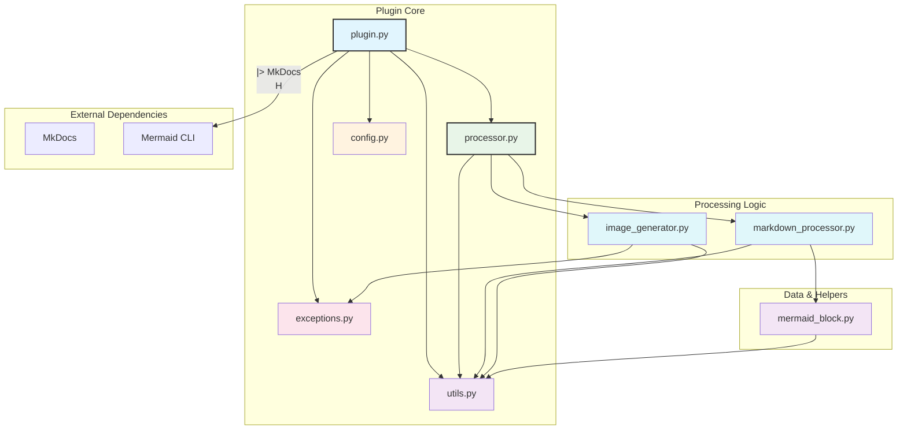
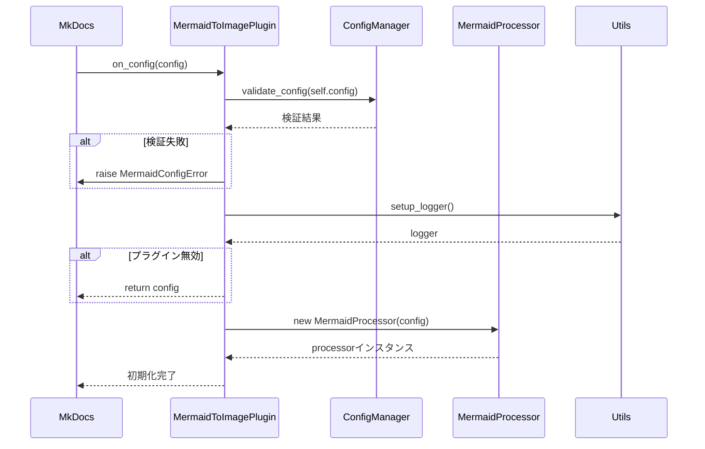
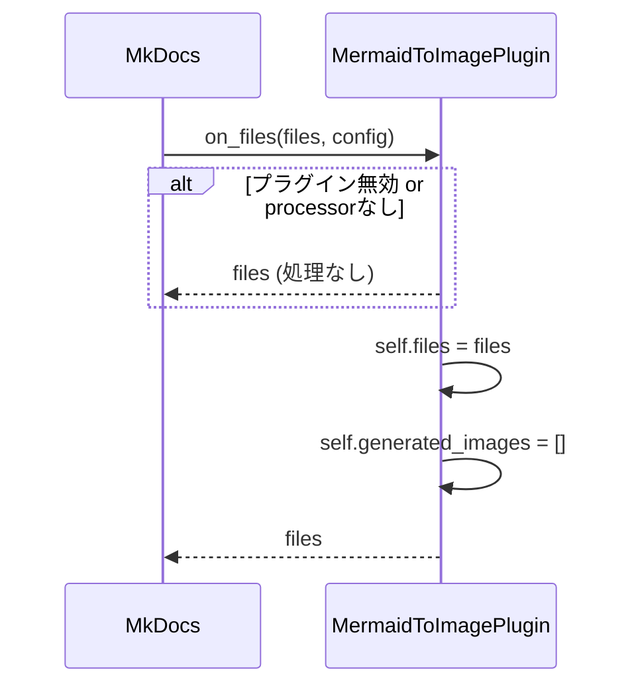
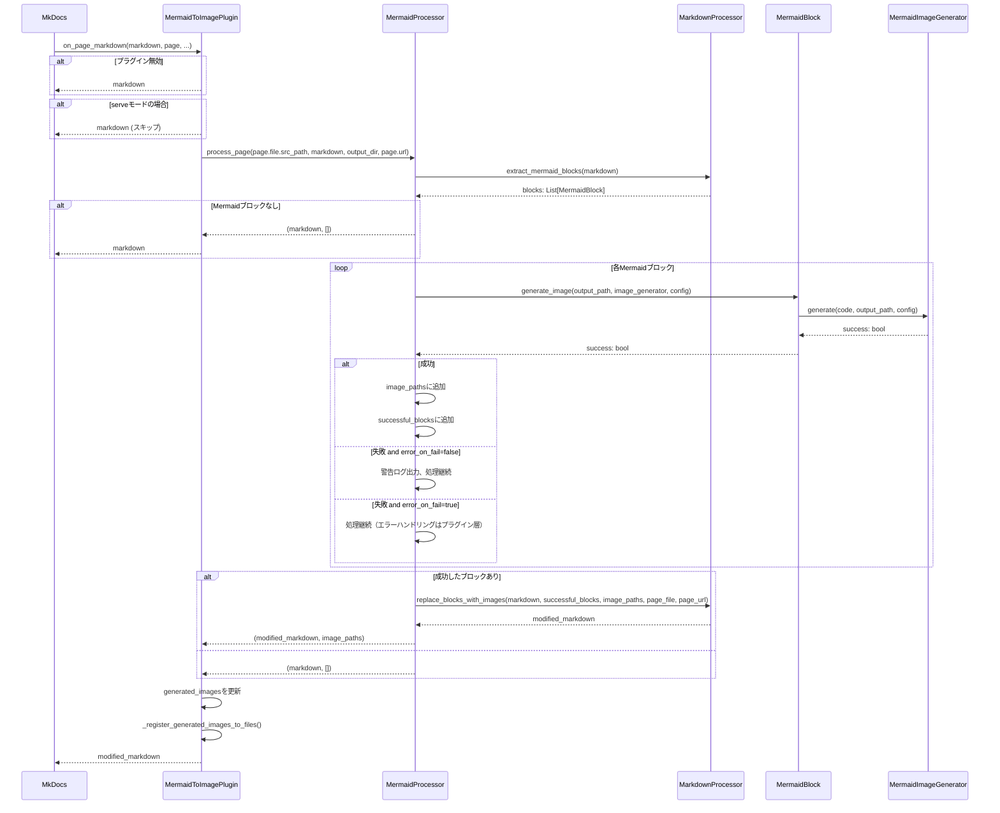
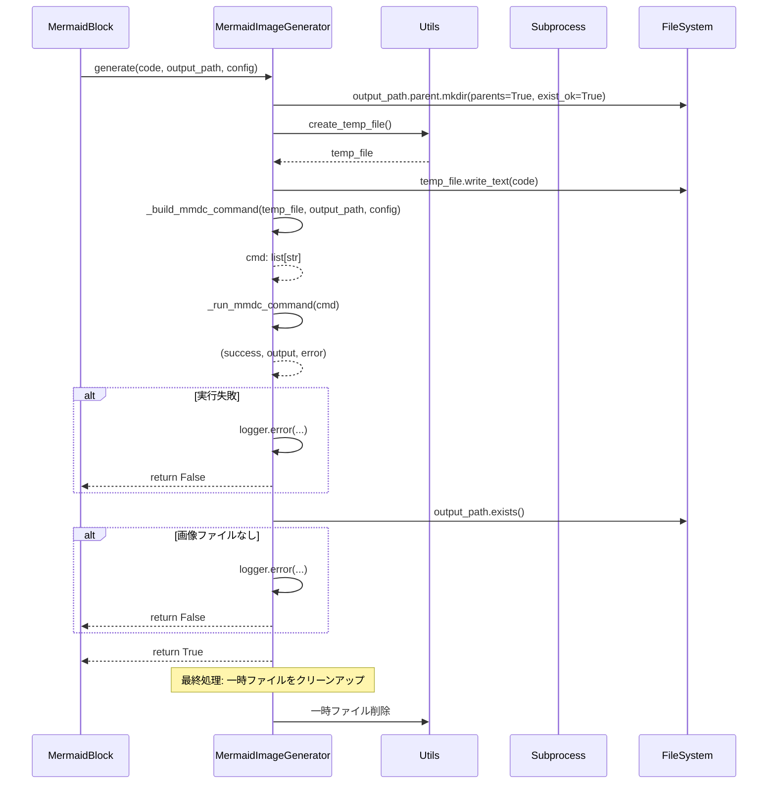
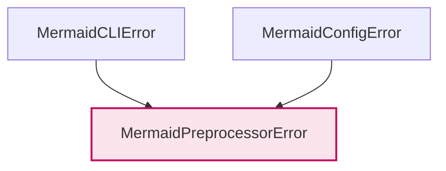

# MkDocs Mermaid to Image Plugin - アーキテクチャ設計

## 概要

MkDocs Mermaid to Image Pluginは、MkDocsプロジェクト内のMermaid図をビルド時に静的画像（PNG/SVG）に変換するプラグインです。Mermaid CLIを利用してMarkdownファイル内のMermaidコードブロックを画像化し、Markdownの内容を画像参照タグに置き換えます。これにより、PDF出力やオフライン環境での閲覧に対応します。

## プロジェクト構造

```
mkdocs-mermaid-to-image/
└── src/
    └── mkdocs_mermaid_to_image/
        ├── __init__.py             # パッケージ初期化・バージョン情報
        ├── plugin.py               # MkDocsプラグインメインクラス (MermaidToImagePlugin)
        ├── processor.py            # ページ処理の統括 (MermaidProcessor)
        ├── markdown_processor.py   # Markdown解析 (MarkdownProcessor)
        ├── image_generator.py      # 画像生成 (MermaidImageGenerator)
        ├── mermaid_block.py        # Mermaidブロック表現 (MermaidBlock)
        ├── config.py               # 設定スキーマ (MermaidPluginConfig, ConfigManager)
        ├── exceptions.py           # カスタム例外クラス
        └── utils.py                # ユーティリティ関数・ロギング設定
```

## ファイル依存関係図



## クラス図

```mermaid
classDiagram
    direction LR

    class BasePlugin {
        <<interface>>
    }

    class MermaidToImagePlugin {
        +MermaidPluginConfig config
        +MermaidProcessor processor
        +Logger logger
        +list~str~ generated_images
        +bool is_serve_mode
        +bool is_verbose_mode
        +on_config(config)
        +on_files(files, config)
        +on_page_markdown(markdown, page, config, files)
        +on_post_build(config)
        +on_serve(server, config, builder)
        -_should_be_enabled(config) bool
        -_process_mermaid_diagrams(markdown, page, config)
        -_register_generated_images_to_files(image_paths, docs_dir, config)
    }
    MermaidToImagePlugin --|> BasePlugin

    class MermaidProcessor {
        +dict config
        +Logger logger
        +MarkdownProcessor markdown_processor
        +MermaidImageGenerator image_generator
        +process_page(page_file, markdown, output_dir, page_url) tuple
    }

    class MarkdownProcessor {
        +dict config
        +Logger logger
        +extract_mermaid_blocks(markdown) List~MermaidBlock~
        +replace_blocks_with_images(markdown, blocks, paths, page_file, page_url) str
    }

    class MermaidImageGenerator {
        +dict config
        +Logger logger
        +generate(code, output_path, config) bool
        -_build_mmdc_command(input_file, output_path, config) list
        -_run_mmdc_command(cmd) tuple
    }

    class MermaidBlock {
        +str code
        +dict attributes
        +int line_number
        +generate_image(output_path, generator, config) bool
        +get_filename(page_file, index, format) str
        +get_image_markdown(image_path, page_file, page_url) str
    }

    class ConfigManager {
        <<static>>
        +validate_config(config) None
        -_validate_path_exists(path, description) None
        -_validate_mmdc_availability(mmdc_path) None
    }

    class MermaidPreprocessorError {<<exception>>}
    class MermaidCLIError {<<exception>>}
    class MermaidConfigError {<<exception>>}

    MermaidCLIError --|> MermaidPreprocessorError
    MermaidConfigError --|> MermaidPreprocessorError

    MermaidToImagePlugin o-- MermaidProcessor
    MermaidToImagePlugin ..> ConfigManager
    MermaidProcessor o-- MarkdownProcessor
    MermaidProcessor o-- MermaidImageGenerator
    MarkdownProcessor --> MermaidBlock : creates
    MermaidBlock --> MermaidImageGenerator : uses
    MermaidImageGenerator --> MermaidCLIError : throws
```



## プラグイン処理フロー

### 1. プラグイン初期化フロー (`on_config`)



### 2. ファイル処理フロー (`on_files`)



### 3. ページ処理フロー (`on_page_markdown`)



### 4. 画像生成フロー (`MermaidBlock.generate_image`)



## 環境別処理戦略

このプラグインは、`mkdocs build`（本番ビルド）と`mkdocs serve`（開発サーバー）で動作を切り替えます。

### モード判定

```python
# src/mkdocs_mermaid_to_image/plugin.py
class MermaidToImagePlugin(BasePlugin[MermaidPluginConfig]):
    def __init__(self) -> None:
        # ...
        self.is_serve_mode: bool = "serve" in sys.argv
        self.is_verbose_mode: bool = "--verbose" in sys.argv or "-v" in sys.argv
```

### プラグイン有効化制御

プラグインの有効化は、環境変数設定に基づいて動的に制御できます：

```python
def _should_be_enabled(self, config: MermaidPluginConfig) -> bool:
    enabled_if_env = config.get("enabled_if_env")
    
    if enabled_if_env is not None:
        # 環境変数の存在と値をチェック
        env_value = os.environ.get(enabled_if_env)
        return env_value is not None and env_value.strip() != ""
    
    # 通常のenabled設定に従う
    return config.get("enabled", True)
```

### ログレベル制御

verboseモードの有無に応じてログ出力を調整：

```python
# verboseモードでない場合は、INFOレベルに設定
if not self.is_verbose_mode:
    log_level = "INFO"
    config_dict["log_level"] = "WARNING"  # 下位モジュールは詳細ログを抑制
else:
    log_level = self.config["log_level"]
```

## プラグイン設定管理

設定は `src/mkdocs_mermaid_to_image/config.py` で一元管理されます。

### 設定スキーマ

```python
class MermaidToImagePlugin(BasePlugin[MermaidPluginConfig]):
    config_scheme = (
        ("enabled", config_options.Type(bool, default=True)),
        ("enabled_if_env", config_options.Optional(config_options.Type(str))),
        ("output_dir", config_options.Type(str, default="assets/images")),
        ("image_format", config_options.Choice(["png", "svg"], default="png")),
        # ... 他の設定項目 ...
        ("cleanup_generated_images", config_options.Type(bool, default=False)),
    )
```

### 設定検証

`ConfigManager.validate_config()` で以下を検証：
- ファイルパスの存在確認
- Mermaid CLIの利用可能性確認
- 設定値の整合性チェック

## ファイル管理戦略

### 生成画像のFiles登録

生成された画像をMkDocsのFilesオブジェクトに動的に追加：

```python
def _register_generated_images_to_files(self, image_paths: list[str], docs_dir: Path, config: Any) -> None:
    if not (image_paths and self.files):
        return

    from mkdocs.structure.files import File

    for image_path in image_paths:
        image_file_path = Path(image_path)
        if image_file_path.exists():
            rel_path = image_file_path.relative_to(docs_dir)
            file_obj = File(str(rel_path), str(docs_dir), str(config["site_dir"]), ...)
            self.files.append(file_obj)
```

### 画像の配置戦略

- **開発時**: `docs_dir` 内の `output_dir` に画像を生成
- **ビルド時**: MkDocsが自動的にサイトディレクトリにコピー
- **クリーンアップ**: `cleanup_generated_images` 設定でビルド後の自動削除が可能

## エラーハンドリング戦略

### 例外階層



### エラー発生時の処理

- **設定エラー (`MermaidConfigError`)**: `on_config`で発生、ビルドプロセスを即座に停止
- **CLI実行エラー (`MermaidCLIError`)**: `image_generator.py`で発生
  - `error_on_fail=true`: ビルドを停止
  - `error_on_fail=false`: エラーログ出力後、処理を継続（該当図は画像化されない）

### ログ出力戦略

- **設定レベル**: `log_level` 設定で制御
- **Verboseモード**: コマンドライン引数 `--verbose` / `-v` で詳細ログを有効化
- **条件付きログ**: 画像生成時は常にINFOレベルで結果を出力
- **下位モジュール**: verboseモードでない場合はWARNINGレベルに制限
