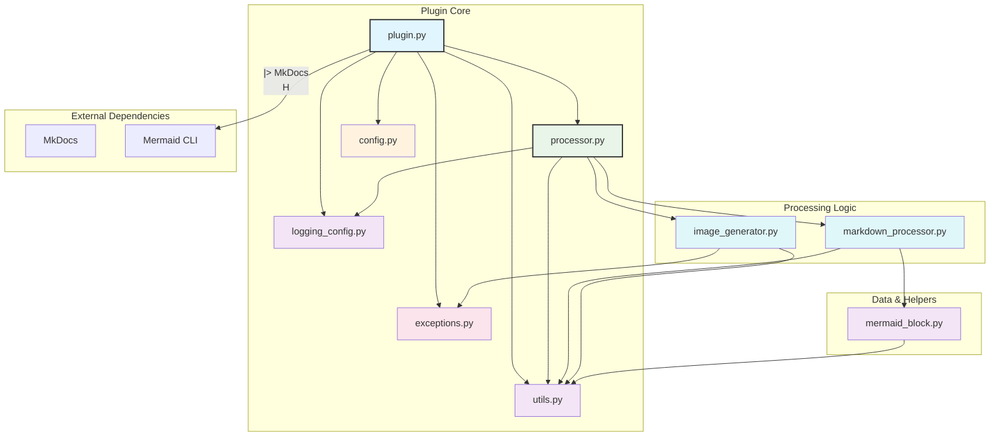
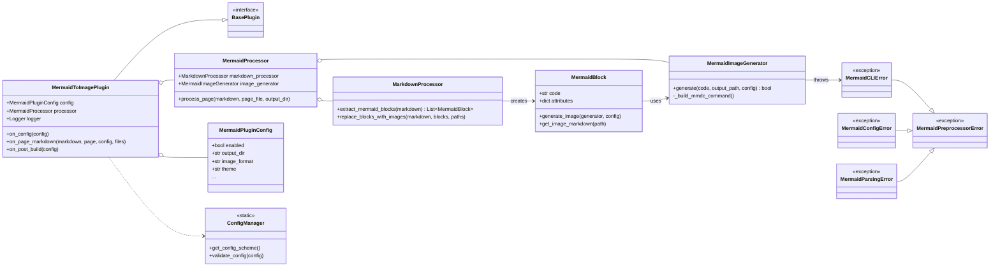
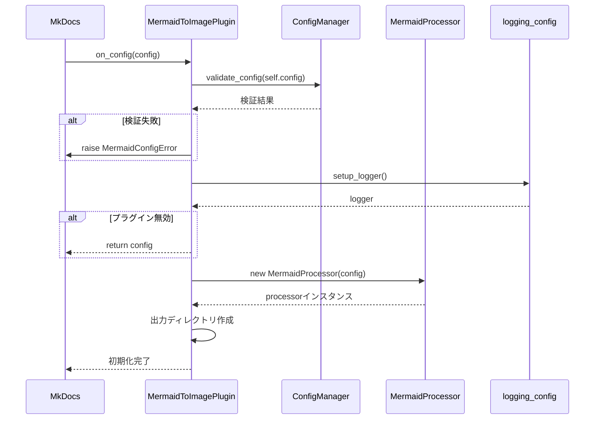
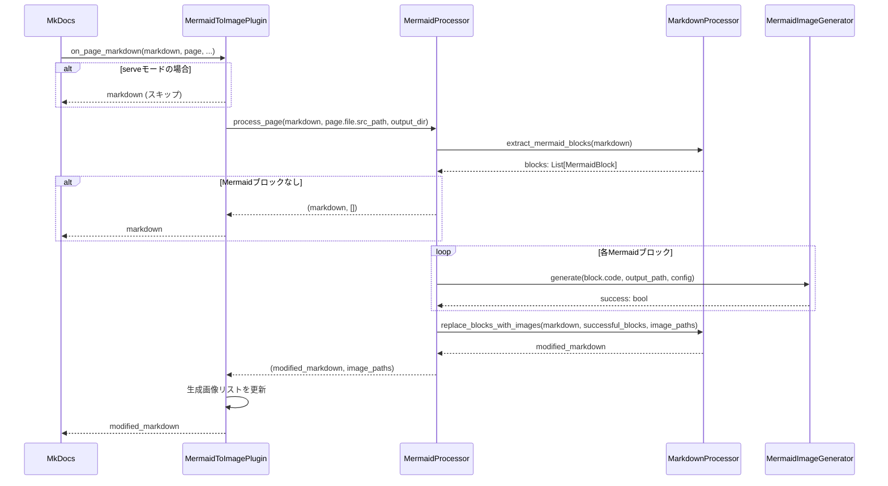
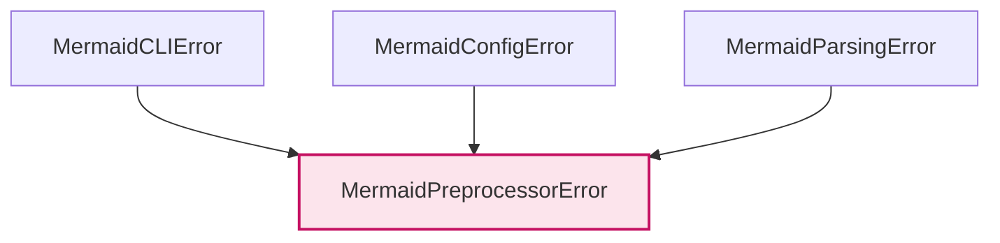

# MkDocs Mermaid to Image Plugin - アーキテクチャ設計

## 概要

MkDocs Mermaid to Image Pluginは、MkDocsプロジェクト内のMermaid図をビルド時に静的画像（PNG/SVG）に変換するプラグインです。Mermaid CLIを利用してMarkdownファイル内のMermaidコードブロックを画像化し、Markdownの内容を画像参照タグに置き換えます。これにより、PDF出力やオフライン環境での閲覧に対応します。

**参考**: MkDocsプラグインシステムの詳細については [`docs/mkdocs-architecture.md`](docs/mkdocs-architecture.md) を参照してください。

## プロジェクト構造

```
mkdocs-mermaid-to-image/
└── src/
    └── mkdocs_mermaid_to_image/
        ├── __init__.py             # パッケージ初期化
        ├── _version.py             # バージョン情報 (setuptools_scm)
        ├── plugin.py               # MkDocsプラグインメインクラス (MermaidToImagePlugin)
        ├── processor.py            # ページ処理の統括 (MermaidProcessor)
        ├── markdown_processor.py   # Markdown解析 (MarkdownProcessor)
        ├── image_generator.py      # 画像生成 (MermaidImageGenerator)
        ├── mermaid_block.py        # Mermaidブロック表現 (MermaidBlock)
        ├── config.py               # 設定スキーマ (MermaidPluginConfig, ConfigManager)
        ├── exceptions.py           # カスタム例外クラス
        ├── types.py                # 型定義
        ├── utils.py                # ユーティリティ関数
        └── logging_config.py       # ロギング設定
```

## ファイル依存関係図



## クラス図



## プラグイン処理フロー

### 1. プラグイン初期化フロー (`on_config`)



### 2. ページ処理フロー (`on_page_markdown`)



### 3. 画像生成フロー (`image_generator.py`)

```mermaid
sequenceDiagram
    participant Proc as MermaidProcessor
    participant ImgGen as MermaidImageGenerator
    participant Utils
    participant Subprocess
    participant FileSystem

    Proc->>ImgGen: generate(code, output_path, config)
    ImgGen->>Utils: get_temp_file_path()
    Utils-->>ImgGen: temp_file

    ImgGen->>FileSystem: write(temp_file, mermaid_code)

    ImgGen->>ImgGen: _build_mmdc_command(temp_file, output_path, config)
    ImgGen-->>ImgGen: cmd: list[str]

    ImgGen->>Subprocess: run(cmd)
    Subprocess-->>ImgGen: result

    alt 実行失敗
        ImgGen->>ImgGen: logger.error(...)
        ImgGen-->>Proc: return False
    end

    ImgGen->>FileSystem: Path(output_path).exists()
    alt 画像ファイルなし
        ImgGen->>ImgGen: logger.error(...)
        ImgGen-->>Proc: return False
    end

    ImgGen-->>Proc: return True

    finally
        ImgGen->>Utils: clean_temp_file(temp_file)
    end
```

## 開発・本番環境での処理分岐戦略

このプラグインは、`mkdocs build`（本番ビルド）と`mkdocs serve`（開発サーバー）で動作を切り替えます。`serve`モードでは、高速なリロードを実現するため、画像の生成処理をスキップします。

この判定は、プラグインの初期化時に `sys.argv` をチェックすることで行われます。

```python
# src/mkdocs_mermaid_to_image/plugin.py
class MermaidToImagePlugin(BasePlugin[MermaidPluginConfig]):
    def __init__(self) -> None:
        # ...
        self.is_serve_mode: bool = "serve" in sys.argv

    def on_page_markdown(self, markdown: str, ...) -> Optional[str]:
        # ...
        if self.is_serve_mode:
            # serveモードでは画像生成をスキップ
            return markdown
        # ... buildモードの処理 ...
```

このシンプルなアプローチにより、`on_startup` フック（MkDocs 1.4+）への依存をなくし、幅広いMkDocsバージョンとの互換性を維持しています。

## プラグイン設定管理

設定は `src/mkdocs_mermaid_to_image/config.py` で一元管理されます。

- **`MermaidPluginConfig`**: `mkdocs.config.base.Config` を継承したクラスで、`mkdocs.yml` で利用可能なすべての設定項目とその型、デフォルト値を定義します。
- **`ConfigManager`**: 設定の検証ロジック（ファイルパスの存在確認など）を提供する静的クラス。`on_config`フック内で呼び出されます。

```python
# src/mkdocs_mermaid_to_image/config.py

class MermaidPluginConfig(Config):
    enabled = config_options.Type(bool, default=True)
    output_dir = config_options.Type(str, default="assets/images")
    # ... 他の設定項目 ...

class ConfigManager:
    @staticmethod
    def validate_config(config: dict[str, Any]) -> bool:
        # ... バリデーションロジック ...
        return True
```

## エラーハンドリング戦略

`src/mkdocs_mermaid_to_image/exceptions.py` で定義されたカスタム例外階層を用いて、エラーの種類に応じた詳細な情報を提供します。

### 例外階層



- **`MermaidPreprocessorError`**: プラグイン内で発生するすべてのカスタム例外の基底クラス。
- **`MermaidCLIError`**: Mermaid CLIの実行に失敗した場合に送出。コマンド、リターンコード、標準エラー出力などの詳細情報を含みます。
- **`MermaidConfigError`**: 設定 (`mkdocs.yml`) に問題がある場合に送出。
- **`MermaidParsingError`**: Markdown内のMermaidブロックの解析に失敗した場合に送出（現在は未使用、将来の拡張用）。

### エラー発生時の処理

- **設定エラー (`MermaidConfigError`)**: `on_config`で発生。ビルドプロセスを即座に停止させます。
- **CLI実行エラー (`MermaidCLIError`)**: `image_generator.py`で発生。`error_on_fail` 設定が `true` の場合はビルドを停止させ、`false` の場合はエラーをログに出力して処理を続行します（該当の図は画像化されません）。
